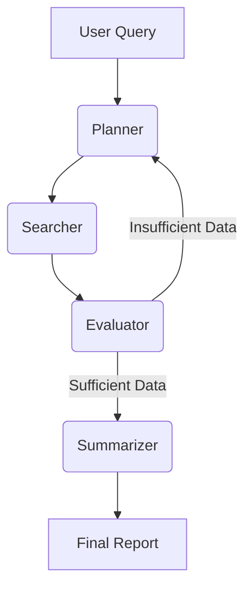

# Autonomous Research Agent

An agentic research system built with **FastAPI**, **LangGraph**, and **Supabase**. The system decomposes high-level research queries into actionable sub-tasks, performs iterative web searches, evaluates data quality, and synthesizes a professional markdown report.

## System Architecture

The agent follows a cyclic planning and execution pattern. It is designed to self-correct by looping back to the planning stage if the initial search results are deemed insufficient by an independent evaluator node.

### Core Components

- **Planner (Gemini 2.5 Flash)**: Breaks the query into 3 distinct sub-queries.
- **Searcher (Tavily API)**: Performs parallel web searches for each sub-query.
- **Evaluator (Gemini 2.5 Flash)**: Assesses if the gathered snippets actually answer the user's intent.
- **Summarizer (Gemini 2.5 Flash)**: Merges all gathered context into a structured, cited report.

## Logic Explanation: Plan-and-Execute

We chose a **Plan-and-Execute** pattern (via LangGraph) over a standard ReAct loop for two reasons:

1. **Parallelism**: Multiple sub-queries can be searched simultaneously, significantly reducing latency compared to serial tool use.
2. **Quality Control**: By separating the "thinking" (planner) from the "judging" (evaluator), we reduce the risk of the agent prematurely declaring victory with shallow information.

## Prompt Library

### 1. Research Planner

> **Objective**: Decompose a complex topic into specific, non-overlapping search queries.
> **Key Instruction**: "Create a step-by-step research plan and decompose this query into specific search queries (max 3)."

### 2. Information Evaluator

> **Objective**: Determine if the information gap is closed.
> **Key Instruction**: "Does the gathered information sufficiently answer the query in detail? Reason step by step."

### 3. Synthesis Summarizer

> **Objective**: Generate a high-fidelity, cited report.
> **Key Instruction**: "Synthesize the findings completely. Resolve any contradictions across the provided sources. Explicitly state the confidence level."
## To run the agent
    python -m uvicorn main:app --reload --port 8000
    
## Tech Stack

- **Backend**: Python, FastAPI, WebSockets.
- **Agent Framework**: LangGraph, LangChain core.
- **LLM**: Google Gemini 2.5 Flash.
- **Search**: Tavily AI.
- **Persistence**: Supabase (Auth & Real-time DB).
- **Frontend**: Vanilla JS, Tailwind CSS.
  
## System Analysis & Stress Test
- check in ANALYSIS.md
